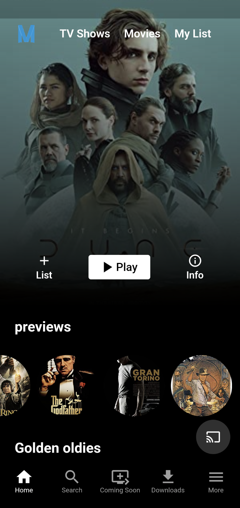

# Myflix

<!-- Improved compatibility of back to top link: See: https://github.com/othneildrew/Best-README-Template/pull/73 -->

<!--
*** Thanks for checking out the Best-README-Template. If you have a suggestion
*** that would make this better, please fork the repo and create a pull request
*** or simply open an issue with the tag "enhancement".
*** Don't forget to give the project a star!
*** Thanks again! Now go create something AMAZING! :D
-->

<!-- PROJECT SHIELDS -->
<!--
*** I'm using markdown "reference style" links for readability.
*** Reference links are enclosed in brackets [ ] instead of parentheses ( ).
*** See the bottom of this document for the declaration of the reference variables
*** for contributors-url, forks-url, etc. This is an optional, concise syntax you may use.
*** https://www.markdownguide.org/basic-syntax/#reference-style-links
-->
[![Contributors][contributors-shield]][contributors-url]
[![Forks][forks-shield]][forks-url]
[![Stargazers][stars-shield]][stars-url]
[![Issues][issues-shield]][issues-url]
[![MIT License][license-shield]][license-url]
[![LinkedIn][linkedin-shield]][linkedin-url]

<!-- PROJECT LOGO -->
 

  

<h3 align="center">Myflix</h3>

  

        An application that allows you to stream <i>your</i> movies from <i>yourself</i>
     
    <a href="https://github.com/rafaelzasas/myflix"><strong>Explore the docs »</strong></a>
     
     
    <a href="https://github.com/rafaelzasas/myflix">View Demo</a>
    ·
    <a href="https://github.com/rafaelzasas/myflix/issues">Report Bug</a>
    ·
    <a href="https://github.com/rafaelzasas/myflix/issues">Request Feature</a>
  

<!-- TABLE OF CONTENTS -->

  
Table of Contents

  <ol>
    <li>
      <a href="#about-the-project">About The Project</a>
      <ul>
        <li><a href="#built-with">Built With</a></li>
      </ul>
    </li>
    <li>
      <a href="#getting-started">Getting Started</a>
      <ul>
        <li><a href="#prerequisites">Prerequisites</a></li>
        <li><a href="#installation">Installation</a></li>
      </ul>
    </li>
    <li><a href="#usage">Usage</a></li>
    <li><a href="#roadmap">Roadmap</a></li>
    <li><a href="#contributing">Contributing</a></li>
    <li><a href="#license">License</a></li>
    <li><a href="#contact">Contact</a></li>
    <li><a href="#acknowledgments">Acknowledgments</a></li>
  </ol>

<!-- ABOUT THE PROJECT -->
## About The Project

</img>

This project is meant to be a way to take it back to the good ol days. The days where you picked out a dvd from the box, put it in the blu ray machine and enjoyed the evening.

 
Nowdays you have to pay for Netflix and Amazon and Hulu and HBO and and and...
 

All the while, you still have all of the movies that you bought on disk from the late 90s through early 2010s.

 
This application will allow you to upload all of those movies to your own server, where you can stream the movies from yourself.

(<a href="#readme-top">back to top</a>)

### Built With

* [![Flutter][Flutter]][Flutter-url]
* [![Go][Go]][Go-url]
* [![Meilisearch][Meilisearch]][Meilisearch-url]

(<a href="#readme-top">back to top</a>)

<!-- GETTING STARTED -->
## Getting Started

This is an example of how you may give instructions on setting up your project locally.
To get a local copy up and running follow these simple example steps.

### Prerequisites

`Under Construciton... 🚧 👷 `

### Installation

1. Under Construction ... 🚧 👷
   

(<a href="#readme-top">back to top</a>)

<!-- USAGE EXAMPLES -->
## Usage

The App is intended to be used the same way you would use netflix. It is however going to be using a computer (laptop, desktop or even Raspberry Pi) within your home network to save movies to and strema movies from.

That means you will need to spend a little bit of time configuring the "Backend" service to the mobile, desktop and web apps.

_For more examples, please refer to the [Documentation](https://github.com/rafaelzasas/myflix/usage)_

(<a href="#readme-top">back to top</a>)

<!-- ROADMAP -->
## Roadmap

### Backend
- [x] Build out basic api in Go
- [ ] Add external api to search for movie metadata
- [ ] Upload movie to server

### UI
  - [x] Display movies
  - [ ] Display shows
  - [ ] Content page show more info and play
  - [ ] Admin Page to upload content with metadata

See the [open issues](https://github.com/rafaelzasas/myflix/issues) for a full list of proposed features (and known issues).

(<a href="#readme-top">back to top</a>)

<!-- CONTRIBUTING -->
## Contributing

Contributions are what make the open source community such an amazing place to learn, inspire, and create. Any contributions you make are **greatly appreciated**.

If you have a suggestion that would make this better, please fork the repo and create a pull request. You can also simply open an issue with the tag "enhancement".
Don't forget to give the project a star! Thanks again!

1. Fork the Project
2. Create your Feature Branch (`git checkout -b feature/AmazingFeature`)
3. Commit your Changes (`git commit -m 'Add some AmazingFeature'`)
4. Push to the Branch (`git push origin feature/AmazingFeature`)
5. Open a Pull Request

(<a href="#readme-top">back to top</a>)

<!-- LICENSE -->
## License

Distributed under the MIT License. See `LICENSE.txt` for more information.

(<a href="#readme-top">back to top</a>)

<!-- CONTACT -->
## Contact

Rafael Zasas | [@rafaelzasas](https://twitter.com/rafaelzasas) | admin@rafaelzasas.com

Project Link: [https://github.com/rafaelzasas/myflix](https://github.com/rafaelzasas/myflix)

(<a href="#readme-top">back to top</a>)

<!-- ACKNOWLEDGMENTS -->
## Acknowledgments

* [Best Readme template](https://github.com/othneildrew/Best-README-Template)
* [MarcusNg Netflix Tutorial](https://github.com/MarcusNg/flutter_netflix_responsive_ui)
* [Tutorial Edge for Go](https://tutorialedge.net/course/golang/)

(<a href="#readme-top">back to top</a>)

<!-- MARKDOWN LINKS & IMAGES -->
<!-- https://www.markdownguide.org/basic-syntax/#reference-style-links -->
[contributors-shield]: https://img.shields.io/github/contributors/rafaelzasas/myflix.svg?style=for-the-badge
[contributors-url]: https://github.com/rafaelzasas/myflix/graphs/contributors
[forks-shield]: https://img.shields.io/github/forks/rafaelzasas/myflix.svg?style=for-the-badge
[forks-url]: https://github.com/rafaelzasas/myflix/network/members
[stars-shield]: https://img.shields.io/github/stars/rafaelzasas/myflix.svg?style=for-the-badge
[stars-url]: https://github.com/rafaelzasas/myflix/stargazers
[issues-shield]: https://img.shields.io/github/issues/rafaelzasas/myflix.svg?style=for-the-badge
[issues-url]: https://github.com/rafaelzasas/myflix/issues
[license-shield]: https://img.shields.io/github/license/rafaelzasas/myflix.svg?style=for-the-badge
[license-url]: https://github.com/rafaelzasas/myflix/blob/master/LICENSE.txt
[linkedin-shield]: https://img.shields.io/badge/-LinkedIn-black.svg?style=for-the-badge&logo=linkedin&colorB=555
[linkedin-url]: https://linkedin.com/in/rafael-zasas
[product-screenshot]: images/screenshot.png

[Flutter]: https://img.shields.io/badge/flutter-000000?style=for-the-badge&logo=flutter&logoColor=blue
[Flutter-url]: https://flutter.dev/
[Go]: https://img.shields.io/badge/go-000000?style=for-the-badge&logo=go&logoColor=blue
[Go-url]: https://go.dev/
[Redis]: https://img.shields.io/badge/redis-000000?style=for-the-badge&logo=redis&logoColor=red
[Redis-url]: https://redis.com
[Meilisearch]: https://img.shields.io/badge/meilisearch-000000?style=for-the-badge&logo=meilisearch&logoColor=blue
[Meilisearch-url]: https://www.meilisearch.com/
